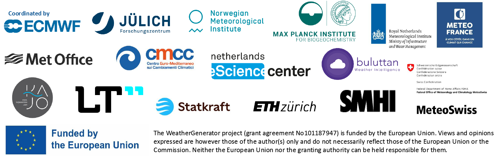

  

  <h1>The WeatherGenerator   Machine Learning Earth System Model</h1>

The WeatherGenerator project is developing a machine learning-based Earth system model. 
It will be trained on a wide range of datasets, including reanalyses, forecast data and observations, to provide a robust and versatile model for the dynamics.
Through this, it can be used for a wide-range of applications. 

More details coming soon. Please open an issue if you are interested in using the model.

  

